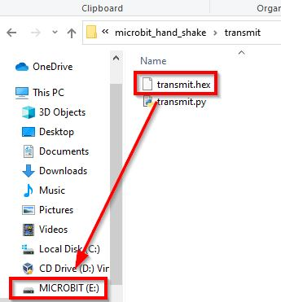

# HandShake set up instructions

Details of the HandShake project and a video of the system in use are here: [https://www.seismicmatt.com/handshake/](https://www.seismicmatt.com/handshake/)

I made some videos which complement these instructions.

How to download the code and install the system is here: [https://youtu.be/FAy9pbkGqI4](https://youtu.be/FAy9pbkGqI4)

How to operate the system is here: [https://youtu.be/MSOVIbfd228](https://youtu.be/MSOVIbfd228)

This site details how to set up and operate the system and complements the videos linked above. Have a look at the project page before reading these.

All of the code for this project can be found on my GitHub site: [https://github.com/hardwaremonkey/microbit_hand_shake](https://github.com/hardwaremonkey/microbit_hand_shake)

The HandShake system consists of two BBC micro:bit boards. One is a transmitter, which is worn on the user’s wrist. The second is the receiver, which is attached to the communication device using a micro USB cable. The transmitter detects a gesture and then communicates this to the receiver micro:bit. The receiver says ‘There’s been a gesture!’ to the communications device. Software running on the communications device then emulates the F1 (function key 1) being pressed and released. Grid 3 reacts to this as if a physical keyboard had just had the F1 key pressed and released.

The software that runs on the communication device runs on both Windows and Linux. I realise that the communications software in common use only runs on Windows. I would like it if communications software also ran on Linux, so the least I could do was make my system run on Linux. I don’t have a Mac to test the system with. This is on my ‘to do’ list.

# Safety

The BBC micro:bit was designed to be safe to use in education with 11-12 year-olds, so has safety designed in.

The transmitter board is powered by two AAA batteries in a case. Normal safety practice should be followed with the batteries – keep them dry.

# Parts

2 x BBC micro:bit boards

1 x AAA battery pack for a micro:bit board

1 x wrist holder

1 x micro USB cable to connect the receiver micro:bit to the communications device.

# Wrist holder for a microbit and AAA battery pack

I tested out a bunch of phone and iPod armband holders. A couple of them can be used to secure a microbit and battery pack to your wrist.

Please see my webpage [here](https://www.seismicmatt.com/2020/09/01/bbc-microbit-wrist-holders/)for more details.

Initially, I made my own, picture below. Details on how to make this using a £5 smartphone armband are here: [https://www.seismicmatt.com/introduction/bbc-microbit-wrist-holder/](https://www.seismicmatt.com/introduction/bbc-microbit-wrist-holder/)

<figure>
  
  <figcaption>microb:bit and AAA battery holder on a home-made wrist holder.</figcaption>
</figure>

# How to set up the system-summary

The transmitter micro:bit goes on your wrist, the receiver micro:bit is connected to your PC or laptop computer using a micro USB cable.

Each of the micro:bits needs different code loaded onto it. The hex files can be drag and dropped onto each micro:bit through a file explorer to program them.

The transmitter is shaken. This shake sends a signal to the receiver. This causes the receiver to send a signal to the computer through the USB port.

A piece of software running on the computer detects this message and sends a keystroke out. This keystroke can be used to control communication software running on the computer.

# How to connect the micro:bit to a Windows machine and load code

Hopefully, you can just plug the micro:bits into the Windows machine and they will be automagically detected. A folder called MICROBIT will appear in your File Explorer. Then you can drag and drop the .hex file containing the code for the micro:bit onto this folder and the board will load the code in about 10s, merrily flashing a little LED. Details below on what hex file goes where.

If you need more detailed instructions on how to connect a micro:bit to a Windows machine and how to load code onto it, please look at my blog post: [https://www.seismicmatt.com/2020/04/27/connecting-the-bbc-microbit-to-windows-and-adding-code-to-it/](https://www.seismicmatt.com/2020/04/27/connecting-the-bbc-microbit-to-windows-and-adding-code-to-it/)

# Downloading the project code

Go to the GitHub site linked at the top of the page. You can download each of the files detailed in the following sections by right clicking and doing ‘save-as’ or you can download the whole repository as a single zip file and unpack it on to your machine by clicking on the green ‘Clone or download’ button then selecting ‘Download ZIP’. See the picture below.

<figure>
  
  <figcaption>Downloading the project code from GitHub.</figcaption>
</figure>

# Programming the micro:bits with hex files

Each micro:bit needs to be programmed using a .hex file.

If you are interested, the code used to generate the hex file can be viewed in the Python script files, which end with a ‘.py’ suffix. You can ignore these .py files if you are just looking to get up and running as quickly as possible. These are included to enable anybody interested to be able to check the code and improve on it.

Connect the transmitter micro:bit to your computer.

The hex file for the transmitter micro:bit is called transmit.hex. This can be found in the transmit sub-directory on the GitHub site. I include the Python script (the .py file) used to generate the .hex file so anybody else can improve on it. You can ignore this .py file unless you are interested in looking at the code. Simply drag and drop the hex file onto the MICROBIT folder and it will load in about 10s, during which you will see an LED on the back of the micro:bit flashing.

<figure>
  
  <figcaption>Drag and drop the transmit.hex file onto the MICROBIT folder with the receiver micro:bit attached.</figcaption>
</figure>

Disconnect the transmitter micro:bit and connect the receiver micro:bit.

The code for the receiver micro:bit is called receive.hex. This can be downloaded by navigating to the receive sub-directory in hand_shake on the GitHub site, then right-clicking on the file and selecting ‘save as’. Drag and drop this onto the MICROBIT folder created when you connect the receiver micro:bit to the computer.

<figure>
  
  <figcaption>Drag and drop the transmit.hex file onto the MICROBIT folder with the transmitter micro:bit attached.</figcaption>
</figure>

Program each of the micro:bits separately – only have one at a time plugged into your computer. Otherwise, the system can't tell which is which.

# Installing the software onto your computer

The software that goes onto your computer is in the base folder of the GitHub directory. This stands for base station. I couldn’t think of a better name. This software monitors the attached receiver microbit for a trigger and then simulates pressing the F1 key on your keyboard. You can adjust the keystroke that is sent out when a shake is detected if you do not want to use F1. Details on how to do this are below.

## Windows